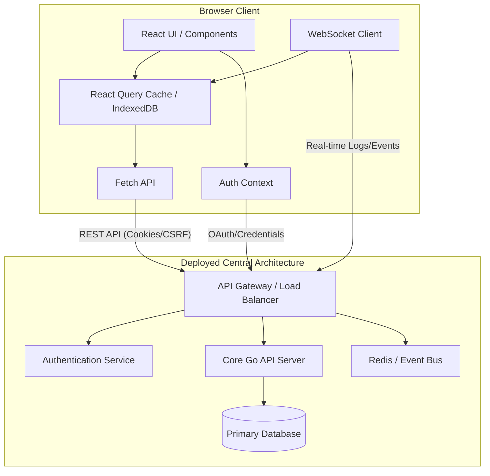

# Client Architecture Overview

Based on the analysis of the `Client` repository, here is a breakdown of the current architecture and the proposed future architecture once the Central Server is fully deployed.

## 1. Current Architecture (Local/Development Phase)

The current client is a Single Page Application (SPA) built to interact directly with a local backend service.

### Core Technologies
- **Framework:** React with TypeScript, bundled by Vite.
- **Routing:** `react-router-dom` for client-side navigation (Dashboard, Functions, Logs, Invocations, etc.).
- **UI & Styling:** Tailwind CSS combined with Shadcn UI components (Toaster, Sonner, Tooltip).
- **State Management:** `@tanstack/react-query` for API data fetching and caching. Local React Context (`AuthContext`) for session state.

### Authentication & Security
- **Mechanism:** Google OAuth (`@react-oauth/google`) and custom Username/Password login.
- **Storage:** JWT tokens and session data (`auth_token`, `auth_email`, `auth_expires`) are stored directly in the browser's `localStorage`.
- **Vulnerability:** Storing tokens in `localStorage` makes them susceptible to Cross-Site Scripting (XSS) attacks.

### Data Flow & API Layer
- **API Client:** A centralized `src/lib/api.ts` uses the native `fetch` API.
- **Endpoints:** Connects directly to `VITE_API_BASE_URL` (defaulting to `http://localhost:8080/api/v1`).
- **Communication:** Synchronous HTTP REST calls for CRUD operations on Lambda functions, logs, and executions. No real-time data streaming is present.

---

## 2. Future Architecture (Production with Central Server)

When migrating to a deployed Central Server, the architecture must evolve to ensure robust security, performance, and scalability.

### Enhanced Security & Authentication
- **Secure Token Storage:** Transition away from `localStorage`. Use **HttpOnly, Secure Cookies** to store JWTs and session tokens. This prevents client-side scripts from accessing the token, mitigating XSS risks.
- **Auth Key Management:** Implement a robust API Key management system in the Settings dashboard. Users should be able to generate, revoke, and securely copy Auth Keys for CLI/WASM node authentication.
- **CSRF Protection:** Introduce CSRF tokens for all mutating operations (POST, PUT, DELETE) against the Central Server.
- **Refresh Token Rotation:** Implement short-lived access tokens combined with secure, rotating refresh tokens.

### Advanced Caching Strategy
- **Aggressive API Caching:** Enhance `@tanstack/react-query` configurations. Use stale-while-revalidate patterns for frequently accessed but rarely changed data (e.g., list of functions).
- **Optimistic UI Updates:** Implement optimistic updates for actions like pausing/resuming schedules or updating function metadata to make the UI feel instantaneous.
- **Offline/Persistent Cache:** Utilize IndexedDB via React Query's persist plugins to cache dashboard state locally. This ensures the dashboard loads immediately upon returning, aligning with a local-first philosophy.

### Real-Time Observability
- **WebSocket/SSE Integration:** Replace HTTP polling for logs and invocations. Introduce **WebSockets** or **Server-Sent Events (SSE)** connecting to the Central Server for real-time log streaming and live execution status updates.
- **Telemetry Aggregation:** The client should efficiently render aggregated telemetry data pushed by the Central Server, possibly using charting libraries (like Recharts) for memory usage and execution durations.

### Deployment & Distribution
- **CDN & Edge Caching:** The Vite build should be deployed to a CDN (e.g., Vercel, Cloudflare Pages, or AWS CloudFront) to cache static assets globally.
- **API Gateway:** The client will communicate with the Central Server through a secure API Gateway, which will handle rate limiting, DDoS protection, and routing.

### Summary Diagram

